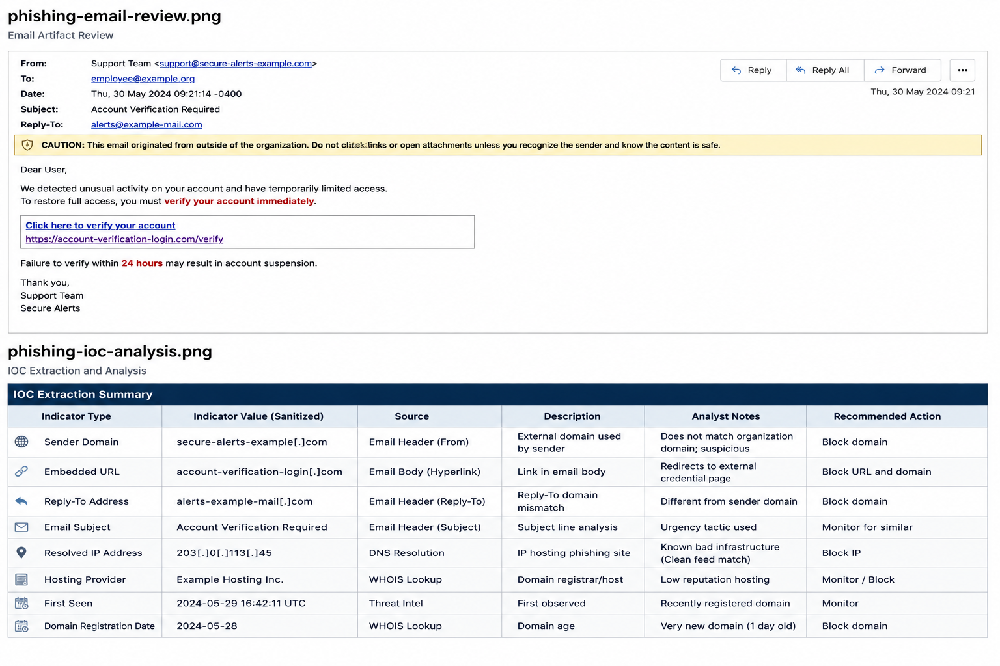

# Phishing Triage Investigation — Email Security Analysis

## Project Summary
This project demonstrates a phishing email triage workflow involving email artifact review, indicator extraction, risk assessment, containment recommendations, and escalation-oriented analyst documentation. All indicators have been sanitized for public portfolio presentation.

## Investigation Objective

Analyze a reported phishing email to identify suspicious indicators, assess risk, document findings, and provide containment and escalation recommendations.

## Investigation Scenario

A user reported a suspicious email containing urgency-based messaging and an embedded hyperlink requesting immediate action. The objective was to determine whether the message represented a phishing attempt, extract relevant indicators, assess risk, and document recommended response actions.

## Analyst Investigation Workflow

- Reviewed email header and message body artifacts.
- Evaluated sender legitimacy and delivery characteristics.
- Identified social engineering techniques and lure indicators.
- Extracted domains, URLs, and email-based indicators.
- Assessed phishing risk and likely attacker objective.
- Documented containment recommendations and escalation guidance.

## Email Artifact Analysis

The reported email was reviewed to identify suspicious sender characteristics, message content indicators, and embedded phishing elements.

## Email Review
### Email Review Evidence

## Findings

The reviewed message contained multiple phishing characteristics:

## Observation	Details
- Message Theme	Account verification request
- Social Engineering Technique	Urgency and fear-based language
- Embedded Hyperlink	Present
- External Sender	Yes
- Credential Harvesting Indicators	Observed

The message attempted to pressure the recipient into immediate action through urgency-based language and an external login request.

## Indicator Extraction Analysis

Indicators of compromise (IOCs) were extracted and documented for investigation and potential blocking activities.

IOC Review

## Findings
| Observation | Details |
|------------|------------|
| Message Theme | Account verification request |
| Social Engineering Technique | Urgency and fear-based language |
| Embedded Hyperlink | Present |
| External Sender | Yes |
| Credential Harvesting Indicators | Observed |
| Indicator Type | Sanitized Value | Observation |

| Indicator Type | Sanitized Value | Observation |
|------------|------------|------------|
| Sender Domain | secure-alerts-example[.]com | Suspicious sender |
| Embedded URL | account-verification-login[.]com | Credential harvesting risk |
| Reply-To Domain | alerts-example-mail[.]com | Domain mismatch observed |
| Email Subject | Account Verification Required | Urgency-based lure |

## Social Engineering Analysis

The message leveraged urgency-based language designed to pressure the recipient into immediate action without verification.

### Indicators Observed

- Account verification theme
- Urgent call to action
- External hyperlink
- Suspicious sender infrastructure
- Potential credential harvesting objective

These characteristics are commonly associated with phishing campaigns targeting user credentials.

## Risk Assessment

The email was evaluated to determine the likelihood of phishing activity and potential business impact.

## Findings

| Assessment Area | Observation |
|----------------|-------------|
| Phishing Indicators | Multiple |
| User Interaction Risk | High |
| Credential Theft Risk | High |
| Malware Delivery Indicators | Not Observed |
| Business Impact | Potential account compromise |

### Risk Rating

**High**

## Analyst Findings

- Reviewed reported phishing email artifacts.
- Identified urgency-based social engineering techniques.
- Extracted sender, URL, and infrastructure indicators.
- Assessed the message as a likely credential harvesting attempt.
- Developed containment and escalation recommendations.
- Documented findings suitable for SOC follow-up.

The combination of urgency language, suspicious sender infrastructure, and embedded external links significantly increased the likelihood of credential theft.

## Containment & Escalation Recommendations
## Recommended Actions

- Block identified domains and URLs at email security controls.
- Search for similar messages across the environment.
- Quarantine related emails where appropriate.
- Notify affected users.
- Reset credentials if user interaction occurred.
- Enable MFA where applicable.
- Escalate to Level 2 investigation if widespread delivery is identified.
  
## Analyst Findings

- Reviewed reported phishing email artifacts.
- Identified urgency-based social engineering techniques.
- Extracted sender, URL, and infrastructure indicators.
- Assessed the message as a likely credential harvesting attempt.
- Developed containment and escalation recommendations.
- Documented findings suitable for SOC follow-up.
- 
## Analyst Conclusion
Analysis of the reported email identified multiple phishing indicators including suspicious sender characteristics, urgency-based social engineering language, and embedded external hyperlinks. Based on the observed evidence, the message was assessed as a phishing attempt designed to obtain user credentials. Containment actions and user awareness guidance were recommended to reduce organizational risk.

## Skills Demonstrated

- Phishing email triage
- Email artifact analysis
- IOC extraction and tracking
- Security investigation workflows
- Risk assessment
- Escalation analysis
- Containment recommendations
- Analyst documentation
- SOC reporting

## Notes
All indicators, domains, and identifying artifacts have been sanitized for safe public sharing. This project is intended to demonstrate SOC investigation workflow, analyst documentation practices, and escalation-oriented reporting.
