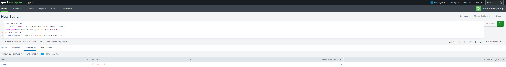

## SIEM Investigation 
## Suspicious Authentication Activity

## Investigation Objective
Investigate suspicious authentication behavior using SIEM search logic, event correlation, and analyst-oriented triage workflows.

## Investigation Scenarios


### 1) Repeated Failed Authentication Followed by Successful Login
- Purpose: identify brute-force or password spraying patterns.

### 2) New Privileged Group Membership Activity
- Purpose: identify privilege escalation indicators.

### 3) Unusual Authentication Time or Source Activity
- Purpose: identify anomaly-based access behavior.

## Analyst Triage & Interpretation
- Triage logic (severity/impact):
- Follow-up pivots:
- Escalation summary approach:

- ## Example SPL Queries

### Repeated Failed Authentication Followed by Success

```spl
index=authentication_logs
| stats count(eval(action="failure")) as failed_attempts,
count(eval(action="success")) as successful_logins
by user, src_ip
| where failed_attempts > 5 AND successful_logins > 0
```

Purpose:
Identify possible brute-force or password spraying activity followed by successful authentication.

---

### New Privileged Group Membership Activity

```spl
index=authentication_logs
EventCode=4728 OR EventCode=4732
```

Purpose:
Detect new privileged group membership events that may indicate privilege escalation activity.

---

### Unusual Authentication Time or Source Activity

```spl
index=authentication_logs
| stats count by user, src_ip, _time
```

Purpose:
Review authentication patterns for unusual login timing, source behavior, or anomalous access activity.

## Investigation Screenshot

### Suspicious Authentication Correlation

The following investigation identified repeated failed authentication attempts followed by a successful login from the same source IP address.


<a href="images/splunk-auth-investigation.png">
  
</a>


## Skills Demonstrated
- SIEM investigation workflows
- Authentication event analysis
- Event correlation
- Suspicious activity triage
- Splunk search logic
- Escalation analysis
- Security monitoring workflows
- Analyst documentation
