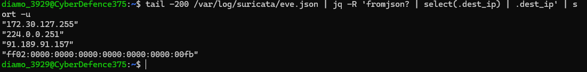

# Suricata Alert Investigation — Suspicious Network Traffic

## Investigation Objective

Analyze Suricata IDS alerts to identify suspicious network behavior, review triggered signatures, and document analyst-oriented investigation findings.

## Investigation Scenario

A network monitoring system generated Suricata IDS alerts associated with suspicious outbound traffic activity. The investigation focused on reviewing alert details, identifying triggered signatures, and assessing potentially malicious communication patterns.

## Analyst Investigation Workflow

- Reviewed Suricata alert output and signature matches.
- Investigated source and destination IP communication.
- Analyzed triggered alert categories and severity levels.
- Correlated suspicious traffic indicators with packet activity.
- Documented investigation findings and escalation considerations.

## Detection Areas Reviewed

- Suspicious outbound traffic
- DNS activity
- HTTP requests
- Signature-triggered alerts
- Protocol anomalies

## Tools & Technologies

- Suricata
- Wireshark
- tcpdump
- Linux command line

## Destination IP Analysis

The following Suricata telemetry analysis identified destination IP activity observed during packet inspection and protocol analysis.

<a href="images/suricata-dest-ip-analysis.png">
  
</a>

### Findings

The Suricata telemetry review identified the following destination addresses:

| Destination IP | Observation |
|---------------|-------------|
| 172.30.127.255 | Internal broadcast traffic observed within the WSL environment. |
| 224.0.0.251 | Multicast DNS (mDNS) discovery traffic. |
| ff02::fb | IPv6 multicast DNS traffic. |
| 91.189.91.157 | External Ubuntu/Canonical infrastructure associated with system services and time synchronization. 

No malicious destination addresses were identified during this review. The observed traffic was consistent with normal operating system and network discovery behavior.

### Command Used
```bash
tail -200 /var/log/suricata/eve.json | jq -R 'fromjson? | select(.dest_ip) | .dest_ip' | sort -u
```

## Skills Demonstrated

- IDS alert triage
- Signature analysis
- Network traffic investigation
- Packet correlation
- Security monitoring workflows
- Analyst documentation
