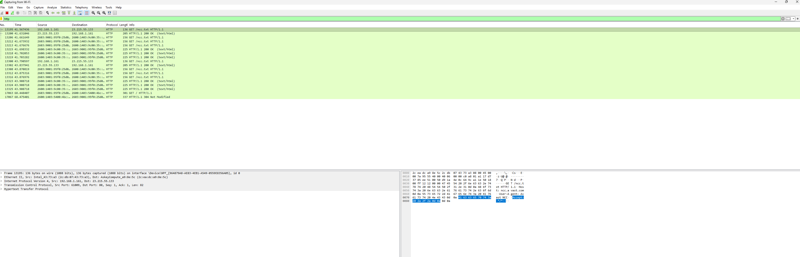
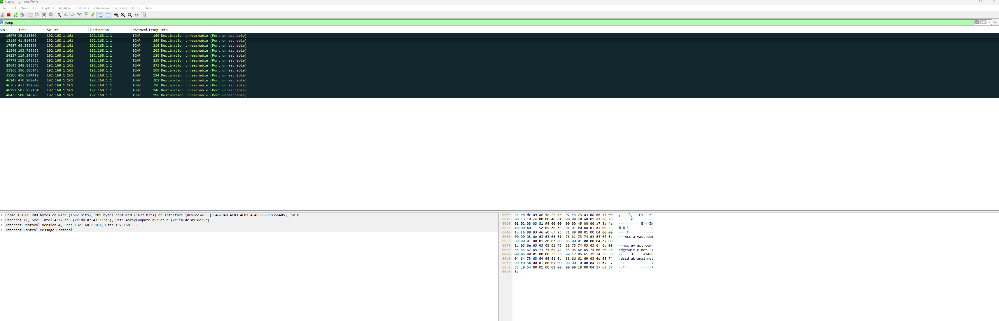
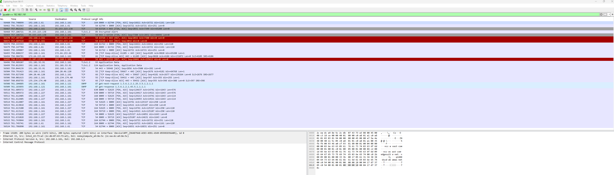

# Wireshark Investigation — Suspicious Network Activity

## Investigation Objective

Analyze captured network traffic to identify suspicious communication patterns, unusual DNS requests, and potential indicators of compromise.

## Investigation Scenario

A workstation generated unusual outbound network activity. The objective was to inspect packet captures, identify suspicious communication patterns, and document findings suitable for escalation or containment review.

## Analyst Investigation Workflow

- Reviewed packet capture traffic using Wireshark.
- Applied protocol and IP-based display filters.
- Investigated DNS requests and HTTP traffic patterns.
- Identified suspicious external communication attempts.
- Documented indicators and investigation findings.

## Protocols Reviewed

- DNS
- HTTP
- TCP
- ICMP

## Wireshark Display Filters Used

### DNS Traffic

```text
dns
```

### HTTP Traffic

```text
http
```

### ICMP Traffic

```text
icmp
```

### Host IP Investigation

```text
ip.addr == <SANITIZED_IP>
```

---

## Investigation Screenshots

### DNS Traffic Analysis

<a href="images/dns_wireshark.png">
  
</a>

### HTTP Traffic Analysis

<a href="images/http_wireshark.png">
  
</a>

### ICMP Traffic Analysis

<a href="images/icmp_wireshark.png">
  
</a>

### Host IP Traffic Review

<a href="images/ip_addr_wireshark.png">
  
</a>

---

## Investigation Findings

- Observed DNS resolution requests for external domains.
- Reviewed HTTP communication behavior and request patterns.
- Analyzed ICMP traffic generated during host connectivity testing.
- Investigated IP-based communication patterns using Wireshark display filters.
- Documented protocol activity and packet-level investigation workflow.

---

## Notes

All screenshots and indicators are sanitized for public portfolio presentation. This project demonstrates packet inspection workflow, protocol analysis, and analyst-oriented investigation documentation.

## Skills Demonstrated

- Packet analysis
- Traffic filtering
- Protocol investigation
- IOC identification
- Network investigation workflows
- Analyst documentation
