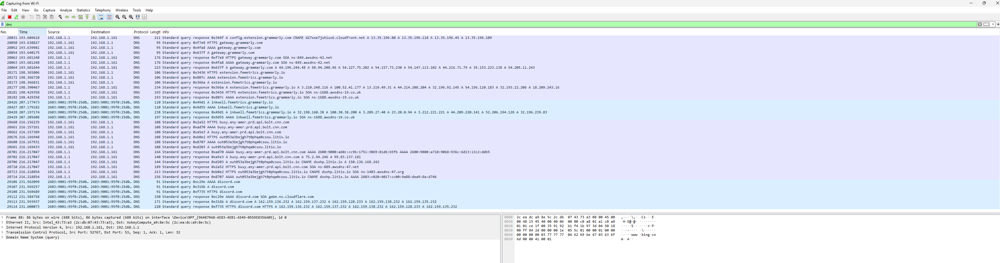

# Wireshark Investigation — Suspicious Network Activity

## Investigation Objective

Analyze captured network traffic to identify suspicious communication patterns, unusual DNS requests, and potential indicators of compromise.

## Investigation Scenario

A workstation generated unusual outbound network activity. The objective was to inspect packet captures, identify suspicious communication patterns, and document findings suitable for escalation or containment review.

## Analyst Investigation Workflow

- Reviewed packet capture traffic using Wireshark.
- Applied protocol and IP-based display filters.
- Investigated DNS requests and HTTP traffic patterns.
- Identified suspicious external communication attempts.
- Documented indicators and investigation findings.

## Protocols Reviewed

- DNS
- HTTP
- TCP
- ICMP

## Wireshark Display Filters Used

### DNS Traffic Analysis


### HTTP Traffic

```text
http
```

### ICMP Traffic

```text
icmp
```

### Host IP Investigation

```text
ip.addr == <SANITIZED_IP>
```

---

## Investigation Screenshots

### DNS Traffic Analysis

<a href="images/dns_wireshark.png">
  
</a>

**Observation**

- The affected workstation generated DNS queries for `<SANITIZED_DOMAIN_1>` and `<SANITIZED_DOMAIN_2>` during the post-execution analysis window.
- The domains resolved to `<SANITIZED_IP_1>`, which was recorded in the IOC tracker.
- The DNS results provided the destination indicators used for threat-intelligence enrichment and further traffic correlation.

**Analyst Assessment**

The DNS activity established that the affected workstation contacted the sanitized domains after the application was executed. DNS evidence alone did not confirm malicious activity, but the timing, destination reputation, and related outbound sessions increased the risk associated with the alert.

### HTTP Traffic Analysis

<a href="images/dns_wireshark.png">
  
</a>

### ICMP Traffic Analysis

<a href="images/dns_wireshark.png">
  
</a>

### Host IP Traffic Review

<a href="images/dns_wireshark.png">
  
</a>

---


## Investigation Findings
- The affected workstation generated DNS queries for the sanitized domains during the post-execution analysis window.
- The sanitized domains resolved to the destination IP recorded in the IOC tracker.
- The host established outbound encrypted sessions with the identified infrastructure.
- Packet-content inspection was limited by TLS encryption; the assessment relied on DNS resolution, destination correlation, timestamps, and connection patterns.
- Connection frequency and timing were reviewed for possible beacon-like behavior, but packet evidence alone did not conclusively confirm command-and-control activity.
- ICMP traffic was consistent with connectivity testing and was not considered part of the suspicious activity.
- The network evidence supported escalation for endpoint validation, file acquisition, persistence review, and environment-wide scoping.
---

## Notes

All screenshots and indicators are sanitized for public portfolio presentation. This project demonstrates packet inspection workflow, protocol analysis, and analyst-oriented investigation documentation.

## Skills Demonstrated

- Packet analysis
- Traffic filtering
- Protocol investigation
- IOC identification
- Network investigation workflows
- Analyst documentation
