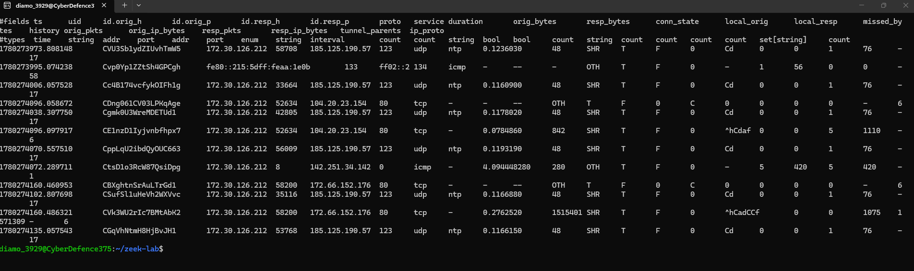
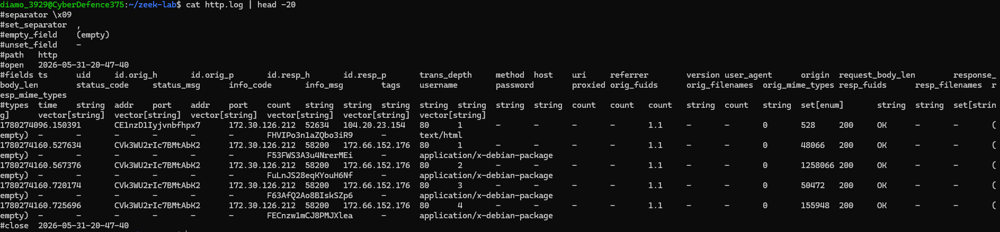
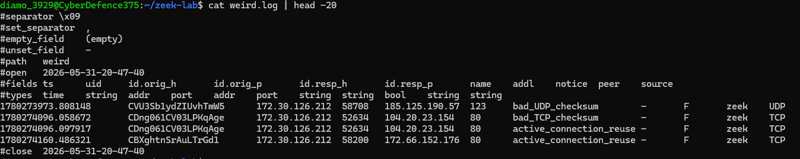

# Zeek Investigation — Network Connection Analysis

## Investigation Objective

Analyze Zeek network logs to identify connection activity, protocol behavior, source and destination communication patterns, and potential indicators of suspicious network behavior.

## Investigation Scenario

Network telemetry was reviewed using Zeek to understand host communication patterns, identify observed services, and document connection-level metadata suitable for SOC analysis and escalation review.

## Analyst Investigation Workflow

- Reviewed Zeek network connection logs.
- Identified source and destination IP communication.
- Analyzed protocol and service metadata.
- Reviewed connection duration, byte counts, and connection states.
- Documented findings and analyst interpretation.

## Zeek Logs Reviewed

- conn.log
- dns.log
- http.log
- ssl.log

## Tools & Technologies

- Zeek
- Linux command line
- jq / text parsing
- Network telemetry analysis

## Connection Analysis

The Zeek connection log was reviewed to identify source and destination communications, protocols, and observed services during packet capture analysis.


### Connection Log Review

<a href="images/zeek-conn-analysis.png">
  
</a>

### Findings

The connection log identified the following communication patterns:

| Source IP | Destination IP | Protocol | Service | Observation |
|------------|------------|------------|------------|------------|
| 172.30.126.212 | 185.125.190.57 | UDP | NTP | Normal time synchronization activity |
| 172.30.126.212 | 104.20.23.154 | TCP | HTTP | Web communication observed |
| 172.30.126.212 | 172.66.152.176 | TCP | HTTP | HTTP traffic associated with testing activity |
| 172.30.126.212 | 142.251.34.142 | ICMP | Ping | Connectivity testing with Google |

No suspicious network connections were identified during this review.

## HTTP Analysis

The Zeek HTTP log was reviewed to identify web requests, response codes, and application-layer metadata observed during packet capture analysis.

### HTTP Log Review

<a href="images/zeek-http-analysis.png">
  
</a>

### Findings

The HTTP log identified successful web communications originating from the monitored host.

| Observation | Details |
|------------|------------|
| Source Host | 172.30.126.212 |
| Protocol | HTTP |
| Response Status | 200 OK |
| HTTP Version | 1.1 |
| Content Type | application/x-debian-package |

The observed traffic was consistent with Ubuntu package repository communications generated during system package installation activities. No suspicious HTTP requests or anomalous response codes were identified.

## Protocol Anomaly Analysis

The Zeek anomaly log (`weird.log`) was reviewed to identify protocol irregularities and unusual network behaviors observed during packet analysis.

### Anomaly Log Review

<a href="images/zeek-weird-analysis.png">
  
</a>

### Findings

The anomaly log identified the following observations:

| Observation | Analyst Interpretation |
|------------|------------|
| bad_UDP_checksum | Expected checksum offloading behavior observed in the WSL virtualized network environment |
| bad_TCP_checksum | Packet checksum validation issue associated with network adapter offloading |
| active_connection_reuse | Normal TCP session reuse observed during HTTP communications |

No anomalous protocol behavior requiring escalation was identified. The observed events were consistent with expected operating system and network stack behavior.

## Analyst Findings

- Reviewed Zeek connection telemetry using conn.log.
- Investigated HTTP request metadata using http.log.
- Identified NTP synchronization communications.
- Observed successful HTTP repository communications.
- Reviewed protocol anomaly records in weird.log.
- Validated checksum-related events as expected virtualization behavior.
- No malicious indicators were identified during analysis.

## Commands Used

```bash
tcpdump -i eth0 -w zeek-investigation.pcap
zeek -r zeek-investigation.pcap
cat conn.log | head -20
cat http.log | head -20
cat weird.log | head -20
```
## Analyst Conclusion

Zeek network telemetry analysis identified expected host communications including NTP synchronization, HTTP package repository activity, and ICMP connectivity testing. Review of connection metadata, HTTP transactions, and protocol anomaly records did not identify malicious network activity or indicators of compromise. Observed checksum warnings were consistent with virtualized network adapter behavior in a WSL environment and did not require escalation.

## Skills Demonstrated

- Network metadata analysis
- Connection log review
- Protocol investigation
- Source and destination IP analysis
- Security monitoring workflows
- Analyst documentation
